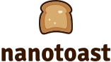

A lightweight and customizable toast notification library for JavaScript with support for success, error, info, warning, message descriptions, async promise handling, and positioning.

## Documentation

https://nanotoast.iamsabbir.dev

## License

MIT

